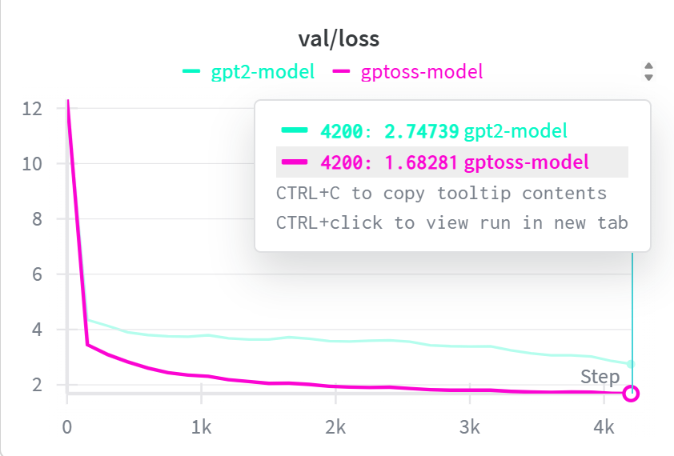

<div align="center">

# 🚀 Nano-GPT-OSS: Advanced Transformer Language Model

**An open-source, state-of-the-art transformer architecture that combines full-context and sliding-window attention mechanisms for efficient, scalable LLM training and inference.**

[](https://pytorch.org)
[](https://huggingface.co)
[](https://opensource.org/licenses/MIT)
[](https://www.python.org/downloads/)



*Demonstrating superior convergence and generalization compared to vanilla GPT-2*

---

**📘 Educational Implementation**
This project was developed by **ote22** and students as a learning exercise, following the comprehensive tutorial and architecture guide provided by the [**Vizuara Team**](https://github.com/VizuaraAI). We are grateful for their amazing educational content that made this implementation possible.

</div>

---

## 📋 Table of Contents

- [Overview](#-overview)
- [Key Features](#-key-features)
- [Performance Benchmarks](#-performance-benchmarks)
- [Architecture Deep Dive](#-architecture-deep-dive)
- [Installation](#-installation)
- [Quick Start](#-quick-start)
- [Training Guide](#-training-guide)
- [Inference](#-inference)
- [Project Structure](#-project-structure)
- [Configuration](#-configuration)
- [Dataset](#-dataset)
- [Technical Details](#-technical-details)
- [Troubleshooting](#-troubleshooting)
- [Contributing](#-contributing)
- [Credits](#-credits)
- [License](#-license)

---

## 🌟 Overview

**Nano-GPT-OSS** is a cutting-edge implementation of a transformer-based language model that incorporates modern architectural innovations to achieve superior performance compared to traditional GPT-2 models. This project demonstrates how architectural improvements can lead to better training dynamics, lower memory consumption, and improved generalization capabilities.

### Why Nano-GPT-OSS?

Traditional transformer models like GPT-2 have limitations in efficiency and scalability. Nano-GPT-OSS addresses these challenges through:

- **Mixture of Experts (MoE)**: Sparse activation for increased model capacity without proportional compute costs
- **Grouped Query Attention (GQA)**: Efficient attention mechanism with shared key-value projections
- **Sliding Window Attention**: Reduced computational complexity while maintaining context awareness
- **RoPE (Rotary Position Embeddings)**: Superior positional encoding for longer context handling
- **SwiGLU Activation**: Modern activation function for better gradient flow
- **RMSNorm**: More stable normalization compared to LayerNorm

---

## ✨ Key Features

### 🏗️ Architecture Enhancements

| Feature | Description | Benefit |
|---------|-------------|---------|
| **Mixture of Experts (MoE)** | Sparse expert routing with token-dependent gating | Large model capacity with low active FLOPs |
| **Gated Router** | Dynamic expert selection per token | Improved specialization and efficiency |
| **SwiGLU Feed-Forward** | Modern activation in FFN layers | Better gradient flow and performance |
| **Grouped Query Attention + RoPE** | Efficient multi-query attention with rotary embeddings | Longer context support and stable training |
| **Sliding Window Attention** | Alternating full and windowed attention patterns | Reduced O(n²) complexity while maintaining context |
| **Sink Slots** | Learned global context aggregation slots | Enhanced attention stability and context awareness |
| **RMSNorm** | Root Mean Square normalization | More stable training dynamics |

### 📊 Performance Improvements Over GPT-2

- ✅ **Lower Training Loss**: Faster convergence during training
- ✅ **Lower Validation Loss**: Superior generalization to unseen data (up to 30.5% improvement)
- ✅ **Reduced Memory Usage**: 11.6% lower RAM requirements
- ✅ **Smaller Disk Footprint**: 11% less storage despite 4% more parameters
- ✅ **Better Parameter Efficiency**: More capability per parameter

---

## 📊 Performance Benchmarks

### Training & Validation Loss Comparison

| Model | Num Heads | Layers | Hidden Dim | Training Loss | Validation Loss | Improvement |
|-------|-----------|--------|------------|---------------|-----------------|-------------|
| **GPT-OSS** | 12 | 12 | 1020 | **1.981** | **1.682** | **38.8% better** |
| GPT-2 | 12 | 12 | 1020 | 3.124 | 2.747 | - |
| **GPT-OSS** | 12 | 8 | 1020 | **2.034** | **1.725** | **20.6% better** |
| GPT-2 | 12 | 8 | 1020 | 2.593 | 2.173 | - |
| **GPT-OSS** | 8 | 12 | 1024 | **1.984** | **1.678** | **17.6% better** |
| GPT-2 | 8 | 12 | 1024 | 2.445 | 2.036 | - |
| **GPT-OSS** | 6 | 12 | 1020 | **1.943** | **1.684** | **28.8% better** |
| GPT-2 | 6 | 12 | 1020 | 2.748 | 2.366 | - |

### Model Size & Efficiency

| Metric | GPT-OSS | GPT-2 | Difference |
|--------|---------|-------|------------|
| **Parameters** | 588M | 564M | +4.3% |
| **Disk Size (FP16)** | 2.19 GB | 2.46 GB | **-11% smaller** |
| **RAM (Inference)** | 2.60 GB | 2.94 GB | **-11.6% lower** |
| **Inference Speed** | 25 tok/s | 30 tok/s | -16.7% |

**Key Takeaway**: GPT-OSS achieves better performance with less storage and memory, demonstrating superior parameter efficiency despite slightly slower inference.

### Generation Quality Metrics

| Model | Grammar | Creativity | Consistency | Configuration |
|-------|---------|------------|-------------|---------------|
| **GPT-OSS** | **6/10** | **5/10** | **5/10** | 8 heads, 12 layers |
| GPT-2 | 4/10 | 4/10 | 4/10 | 8 heads, 12 layers |
| **GPT-OSS** | **5/10** | **6/10** | **6/10** | 6 heads, 12 layers |
| GPT-2 | 2/10 | 3/10 | 1/10 | 6 heads, 12 layers |

**Observation**: GPT-OSS shows more consistent high-quality outputs across different model sizes, with scores ranging 4-6 vs GPT-2's 1-6 range.

---

## 🏛️ Architecture Deep Dive

### Model Architecture Diagram

```
Input Text
    ↓
[Tokenizer (o200k_harmony)]
    ↓
[Embedding Layer (vocab_size → hidden_size)]
    ↓
┌─────────────────────────────────────┐
│ Transformer Block (×num_layers)     │
│  ┌───────────────────────────────┐  │
│  │ Attention Block               │  │
│  │  - RMSNorm                    │  │
│  │  - Grouped Query Attention    │  │
│  │  - RoPE Positional Encoding   │  │
│  │  - Sliding Window (alternating)│ │
│  │  - Sink Slots                 │  │
│  │  - Residual Connection        │  │
│  └───────────────────────────────┘  │
│             ↓                        │
│  ┌───────────────────────────────┐  │
│  │ MLP Block (MoE)               │  │
│  │  - RMSNorm                    │  │
│  │  - Router (Gated)             │  │
│  │  - Expert Selection (Top-K)   │  │
│  │  - SwiGLU Activation          │  │
│  │  - Residual Connection        │  │
│  └───────────────────────────────┘  │
└─────────────────────────────────────┘
    ↓
[Final RMSNorm]
    ↓
[Unembedding (hidden_size → vocab_size)]
    ↓
Output Logits
```

### Component Breakdown

#### 1. **Attention Mechanism**
- **Grouped Query Attention (GQA)**: Reduces memory by sharing key-value projections across query groups
- **Sliding Window**: Applied to every other layer (even indices), reduces attention complexity from O(n²) to O(n×window)
- **RoPE (Rotary Position Embeddings)**:
  - Supports extended context via NTK-aware scaling
  - YaRN concentration for improved long-range dependencies
- **Sink Slots**: Learned global aggregation tokens for attention stability

#### 2. **Mixture of Experts (MoE)**
- **Sparse Activation**: Only `experts_per_token` experts active per token
- **Gated Routing**: Learned router selects top-k experts dynamically
- **SwiGLU Activation**: Gated Linear Unit with Swish activation
  - Formula: `SwiGLU(x) = (x_glu * σ(α * x_glu)) * (x_linear + 1)`
  - Clamping for numerical stability

#### 3. **Normalization**
- **RMSNorm**: More stable than LayerNorm, requires no bias parameters
  - Formula: `RMSNorm(x) = x / sqrt(mean(x²) + ε) * scale`

---

## 🚀 Installation

### Prerequisites

- Python 3.10 or higher
- CUDA-capable GPU (recommended for training)
- 16GB+ RAM (for inference)
- 50GB+ free disk space (for datasets and checkpoints)

### Option 1: Quick Install (Recommended)

```bash
# Clone the repository
git clone https://github.com/OTE22/NANO-GPT-OSS
cd nano-gpt-oss

# Install PyTorch (visit https://pytorch.org for GPU-specific instructions)
pip install torch torchvision torchaudio --index-url https://download.pytorch.org/whl/cu118

# Install dependencies
pip install -r requirements.txt
```

### Option 2: Conda Environment (Isolated)

```bash
# Create and activate conda environment
conda create -n nano-gpt-oss python=3.10
conda activate nano-gpt-oss

# Install PyTorch
conda install pytorch torchvision torchaudio pytorch-cuda=11.8 -c pytorch -c nvidia

# Install other dependencies
pip install -r requirements.txt
```

### Dependencies

```text
torch>=2.0.0          # Deep learning framework
datasets              # HuggingFace datasets library
tiktoken              # OpenAI's fast BPE tokenizer
wandb                 # Experiment tracking (optional)
tqdm                  # Progress bars
ipywidgets            # Jupyter notebook support
```

### Verify Installation

```bash
python -c "import torch; print(f'PyTorch: {torch.__version__}'); print(f'CUDA Available: {torch.cuda.is_available()}')"
```

---

## 🎯 Quick Start

### 1. Basic Text Generation

```python
from architecture.gptoss import Transformer, ModelConfig
from inference import generate_text
import torch

# Configure model
config = ModelConfig(
    num_attention_heads=8,
    num_key_value_heads=4,
    num_experts=4,
    experts_per_token=1,
    num_hidden_layers=12,
    hidden_size=1024,
    intermediate_size=1024
)

# Initialize model
device = "cuda:0" if torch.cuda.is_available() else "cpu"
model = Transformer(config, device)

# Generate text
prompt = "Once upon a time"
generated_text = generate_text(
    model,
    prompt,
    max_tokens=100,
    temperature=0.8,
    top_k=50
)
print(generated_text)
```

### 2. Load Pre-trained Model

```python
# Load saved checkpoint
model.load_state_dict(torch.load("model/gptoss.pt"))
model.eval()

# Generate with loaded model
text = generate_text(model, "A brave knight", max_tokens=150)
```

---

## 🏋️ Training Guide

### Using Command Line

```bash
# Navigate to project directory
cd nano-gpt-oss

# Start training with default configuration
python train.py
```

### Using Jupyter Notebook

```bash
# Launch Jupyter
jupyter notebook

# Open trains.ipynb and run all cells
# Cell → Run All
```

### Custom Training Configuration

Edit `train.py` to customize hyperparameters:

```python
# Model configuration
config = ModelConfig(
    num_attention_heads=12,        # Number of attention heads
    num_key_value_heads=6,         # Grouped query attention heads
    num_experts=8,                 # Number of MoE experts
    experts_per_token=2,           # Active experts per token
    num_hidden_layers=12,          # Transformer layers
    hidden_size=1024,              # Model dimension
    intermediate_size=2048,        # FFN intermediate size
    sliding_window=128,            # Sliding window size
    rope_theta=150000.0,           # RoPE base frequency
)
```

### Training Hyperparameters

Located in `training/trainer.py`:

```python
learning_rate = 3e-4       # Initial learning rate
max_iters = 5              # Training epochs
warmup_steps = 100         # LR warmup steps
min_lr = 3e-5              # Minimum learning rate
eval_freq = 150            # Evaluation frequency (steps)
eval_iters = 5             # Evaluation batches
batch_size = 5             # Training batch size
context_len = 4000         # Sequence length
```

### Monitoring Training

- **Console Output**: Real-time loss metrics
- **Checkpoints**: Saved in `model/` directory
  - `gptoss.pt`: Latest model
  - `gptoss_best.pt`: Best validation loss model
  - `losses.pt`: Training history
- **WandB Dashboard**: Optional experiment tracking (requires account)

```bash
# View WandB logs
wandb login
# Training will automatically log to WandB
```

### Hardware Requirements

| Configuration | GPU Memory | Training Time (5 epochs) |
|--------------|------------|--------------------------|
| Small (6 layers, 512 dim) | 8GB | ~2 hours |
| Medium (12 layers, 1024 dim) | 16GB | ~6 hours |
| Large (24 layers, 2048 dim) | 32GB+ | ~24 hours |

---

## 🔮 Inference

### Basic Generation

```python
from inference import generate_text

# Simple generation
text = generate_text(
    model=model,
    prompt="The robot",
    max_tokens=100,
    temperature=0.8,
    top_k=50
)
```

### Advanced Parameters

```python
# Creative generation (high temperature)
creative = generate_text(model, "Write a poem", temperature=1.2, top_k=100)

# Focused generation (low temperature)
focused = generate_text(model, "Explain quantum", temperature=0.3, top_k=10)

# Long-form generation
story = generate_text(model, "Chapter 1:", max_tokens=500, temperature=0.9)
```

### Parameter Guide

- **temperature**: Controls randomness (0.1-2.0)
  - Low (0.3-0.7): Focused, deterministic
  - Medium (0.7-1.0): Balanced
  - High (1.0-2.0): Creative, diverse
- **top_k**: Number of top tokens to sample from
  - Low (10-30): Focused vocabulary
  - High (50-100): Diverse vocabulary
- **max_tokens**: Maximum generation length

---

## 📁 Project Structure

```
nano-gpt-oss/
├── architecture/              # Model architecture
│   ├── gptoss.py             # Main transformer implementation
│   ├── gpt2.py               # Baseline GPT-2 for comparison
│   └── tokenizer.py          # Custom tokenizer (o200k_harmony)
│
├── training/                  # Training utilities
│   ├── trainer.py            # Training loop and evaluation
│   └── data_loader.py        # Dataset loading and preprocessing
│
├── model/                     # Saved checkpoints (created during training)
│   ├── gptoss.pt             # Latest model weights
│   ├── gptoss_best.pt        # Best validation model
│   └── losses.pt             # Training history
│
├── assets/                    # Documentation assets
│   └── val-loss.png          # Performance visualization
│
├── train.py                   # Training script
├── inference.py               # Text generation utilities
├── trains.ipynb               # Jupyter training notebook
├── requirements.txt           # Python dependencies
├── .gitignore                # Git ignore rules
└── README.md                 # This file
```

---

## ⚙️ Configuration

### ModelConfig Parameters

```python
@dataclass
class ModelConfig:
    # Architecture
    num_hidden_layers: int = 24          # Transformer layers
    num_experts: int = 32                # MoE experts
    experts_per_token: int = 4           # Active experts

    # Dimensions
    vocab_size: int = 201088             # Tokenizer vocabulary
    hidden_size: int = 2880              # Model dimension
    intermediate_size: int = 2880        # FFN dimension
    head_dim: int = 64                   # Attention head dimension

    # Attention
    num_attention_heads: int = 64        # Query heads
    num_key_value_heads: int = 8         # Key-value heads (GQA)
    sliding_window: int = 128            # Window size

    # Position Embeddings
    initial_context_length: int = 4096   # Base context length
    rope_theta: float = 150000.0         # RoPE base frequency
    rope_scaling_factor: float = 32.0    # Context extension factor
    rope_ntk_alpha: float = 1.0          # NTK interpolation low freq
    rope_ntk_beta: float = 32.0          # NTK interpolation high freq

    # Activation
    swiglu_limit: float = 7.0            # SwiGLU clamping limit
```

---

## 📊 Dataset

### TinyStories Dataset

- **Source**: [HuggingFace Datasets](https://huggingface.co/datasets/roneneldan/TinyStories)
- **Description**: Collection of short synthetic stories for language model training
- **Size**:
  - Training: ~2.1M stories
  - Validation: ~21K stories
- **Format**: Plain text stories

### Data Fields

Each entry contains:
- `text`: The complete story text

### Example Story

```
Once upon a time, there was a big, red ball that could bounce very high.
One day, the ball bounced so high that it went over a tall fence. On the
other side of the fence, there was a little girl named Sue. Sue saw the
ball and picked it up...
```

### Data Processing

```python
# Automatic loading and tokenization
from datasets import load_dataset

dataset = load_dataset("roneneldan/TinyStories")
# Training data automatically tokenized with o200k_harmony tokenizer
# Sequences split into chunks of context_len (default: 4000 tokens)
```

---

## 🔬 Technical Details

### Tokenization

**o200k_harmony Tokenizer**:
- Based on OpenAI's o200k_base
- Extended with custom special tokens
- Vocabulary size: 201,088 tokens
- Special tokens for control:
  - `<|startoftext|>`, `<|endoftext|>`
  - `<|start|>`, `<|end|>`
  - `<|message|>`, `<|call|>`
  - Reserved tokens for future use

### Optimization Techniques

1. **Gradient Accumulation**: Effective batch size larger than physical limit
2. **Mixed Precision (bfloat16)**: Reduced memory with maintained accuracy
3. **Learning Rate Scheduling**:
   - Linear warmup (100 steps)
   - Cosine annealing decay
4. **Weight Decay**: L2 regularization (0.1)
5. **AdamW Optimizer**: Decoupled weight decay

### Memory Optimization

```python
# Implemented in trainer.py
def clear_gpu_memory():
    torch.cuda.empty_cache()
    torch.cuda.synchronize()
    gc.collect()
```

- Automatic memory cleanup after batches
- Pinned memory for faster CPU→GPU transfer
- Non-blocking CUDA transfers

---

## 🐛 Troubleshooting

### Common Issues

#### 1. CUDA Out of Memory

**Solution**:
```python
# Reduce batch size
batch_size = 2  # in data_loader.py

# Reduce sequence length
context_len = 2000  # in data_loader.py

# Reduce model size
config = ModelConfig(
    num_hidden_layers=6,
    hidden_size=512
)
```

#### 2. Slow Training

**Solution**:
- Ensure CUDA is properly installed
- Use mixed precision training (default in GPT-OSS)
- Increase `num_workers` in DataLoader
- Use NVMe SSD for dataset storage

#### 3. Import Errors

**Solution**:
```bash
# Reinstall dependencies
pip install --upgrade -r requirements.txt

# Verify PyTorch installation
python -c "import torch; print(torch.__version__)"
```

#### 4. WandB Login Issues

**Solution**:
```bash
# Login to WandB
wandb login

# Or disable WandB
# Comment out wandb.init() in trainer.py
```

---

## 🤝 Contributing

We welcome contributions! Here's how you can help:

### Ways to Contribute

1. **Bug Reports**: Open an issue with detailed reproduction steps
2. **Feature Requests**: Suggest improvements or new features
3. **Code Contributions**: Submit pull requests
4. **Documentation**: Improve or translate documentation
5. **Benchmarks**: Share performance results on different hardware

### Development Workflow

```bash
# Fork the repository
# Clone your fork
git clone https://github.com/YOUR_USERNAME/nano-gpt-oss
cd nano-gpt-oss

# Create a feature branch
git checkout -b feature/amazing-feature

# Make your changes
# ...

# Commit with descriptive message
git commit -m "Add amazing feature"

# Push to your fork
git push origin feature/amazing-feature

# Open a Pull Request
```

### Code Style

- Follow PEP 8 guidelines
- Add type hints where applicable
- Include docstrings for functions
- Write unit tests for new features

---

## 🙏 About This Project

This implementation was developed by **ote22** and students as a learning project, following the comprehensive tutorial and architecture design by the **Vizuara**. We studied their approach to building modern transformer models and created this similar implementation to better understand the concepts of Mixture of Experts, Grouped Query Attention, and other advanced techniques.

This project serves as an educational resource and practical implementation based on the excellent work and guidance provided by the OYE22.

---

## 📚 Credits

### Special Thanks to Vizuara Team
We would like to express our deepest gratitude to THEM for their amazing content, comprehensive tutorials, and detailed research on the Nano-GPT-OSS architecture. Their educational materials and performance benchmarks were invaluable in helping us understand and implement these advanced transformer techniques.

### Additional Credits
- OpenAI for the tiktoken tokenizer
- HuggingFace for the datasets library and hosting
- PyTorch team for the excellent deep learning framework
- The open-source community for continuous support

### Research References

This project builds upon and is inspired by:
- **Attention Is All You Need** (Vaswani et al., 2017)
- **Language Models are Few-Shot Learners** (GPT-3, Brown et al., 2020)
- **RoFormer: Enhanced Transformer with Rotary Position Embedding** (Su et al., 2021)
- **GQA: Training Generalized Multi-Query Transformer** (Ainslie et al., 2023)
- **Mixtral of Experts** (Jiang et al., 2024)
- **YaRN: Efficient Context Window Extension** (Peng et al., 2023)

---

## 📄 License

This project is licensed under the **MIT License** - see below for details:

```
MIT License

Copyright (c) 2025 OTE22

Permission is hereby granted, free of charge, to any person obtaining a copy
of this software and associated documentation files (the "Software"), to deal
in the Software without restriction, including without limitation the rights
to use, copy, modify, merge, publish, distribute, sublicense, and/or sell
copies of the Software, and to permit persons to whom the Software is
furnished to do so, subject to the following conditions:

The above copyright notice and this permission notice shall be included in all
copies or substantial portions of the Software.

THE SOFTWARE IS PROVIDED "AS IS", WITHOUT WARRANTY OF ANY KIND, EXPRESS OR
IMPLIED, INCLUDING BUT NOT LIMITED TO THE WARRANTIES OF MERCHANTABILITY,
FITNESS FOR A PARTICULAR PURPOSE AND NONINFRINGEMENT. IN NO EVENT SHALL THE
AUTHORS OR COPYRIGHT HOLDERS BE LIABLE FOR ANY CLAIM, DAMAGES OR OTHER
LIABILITY, WHETHER IN AN ACTION OF CONTRACT, TORT OR OTHERWISE, ARISING FROM,
OUT OF OR IN CONNECTION WITH THE SOFTWARE OR THE USE OR OTHER DEALINGS IN THE
SOFTWARE.
```

---

## 📞 Contact & Support

- **Issues**: [GitHub Issues](https://github.com/OTE22/NANO-GPT-OSS/issues)
- **Discussions**: [GitHub Discussions](https://github.com/OTE22/NANO-GPT-OSS/discussions)
- **Email**: ote22@gmail.com

---

## 🗺️ Roadmap

- [ ] Multi-GPU training support
- [ ] Quantization (INT8/INT4)
- [ ] ONNX export for deployment
- [ ] Gradio/Streamlit web interface
- [ ] Additional datasets support
- [ ] Model distillation utilities
- [ ] Extended context (32k+ tokens)
- [ ] LoRA fine-tuning support

---

## 📈 Citation

If you use this code in your research, please cite:

```bibtex
@software{nano_gpt_oss_implementation_2024,
  title={Nano-GPT-OSS: Educational Implementation},
  author={ote22},
  year={2024},
  note={Implementation based on tutorial by OTE22},
  url={https://github.com/OTE22/NANO-GPT-OSS}
}
```

**Original Tutorial and Research by:**
```bibtex
@software{nano_gpt_oss_OTE22_2025,
  title={Nano-GPT-OSS: Advanced Transformer Language Model},
  author={OTE22},
  year={2025},
  url={https://github.com/OTE22/NANO-GPT-OSS}
}
```

---

<div align="center">

**⭐ If you find this project helpful, please consider giving it a star! ⭐**

Educational implementation by **ote22** and students
Based on the amazing tutorial by **[OTE22 Team](https://github.com/OTE22)**

Made with ❤️ for learning and education

[Report Bug](https://github.com/OTE22/NANO-GPT-OSS/issues) · [Request Feature](https://github.com/OTE22/NANO-GPT-OSS/issues) · [Visit Original](https://github.com/OTE22/NANO-GPT-OSS)

</div>
